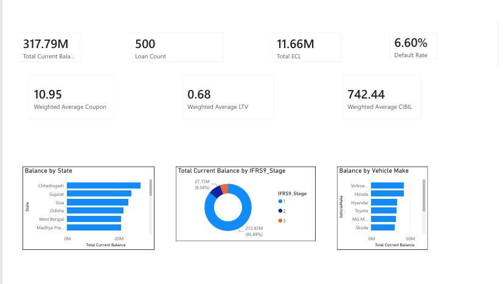
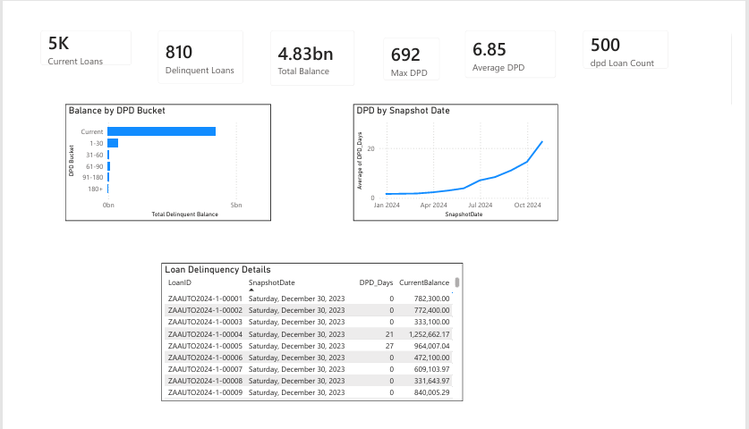
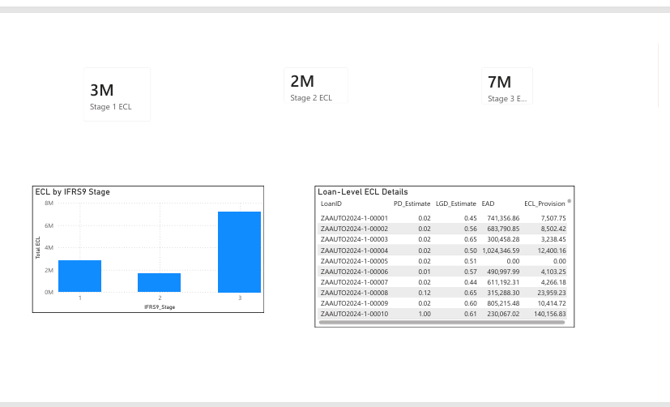
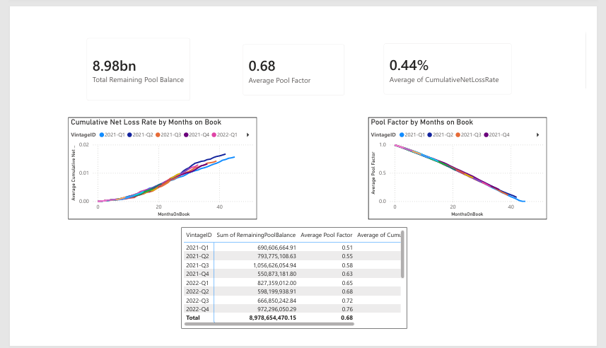
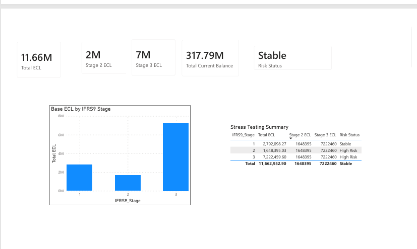
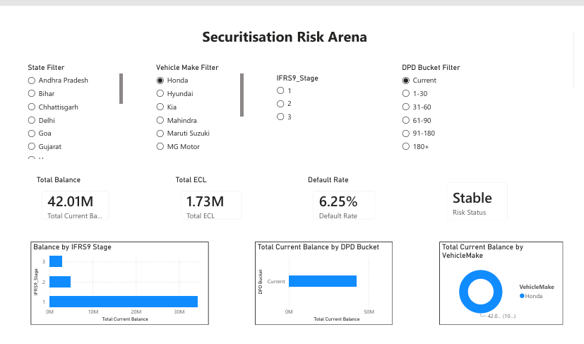

# Data Analyst Securitisation Dashboard

## Overview

Developed a comprehensive securitisation risk assessment dashboard using Microsoft Power BI, advanced DAX, Power Query, and data modeling techniques.

## Project Objectives

- IFRS 9 Expected Credit Loss (ECL)
- Waterfall Analysis
- Stress Testing
- Investor Reporting
- Vintage Analysis
- Delinquency Analysis
- Portfolio Risk Monitoring
- Securitisation Risk Arena Simulation

## Tools Used

- Microsoft Power BI
- DAX
- Power Query
- Power Pivot
- Excel
- SQL Concepts

## Dataset

- Auto Loan Securitisation Data
- DPD Snapshot History
- Dynamic Loss Monthly
- Static Pool Vintage Data

## Dashboard Pages

- Executive Overview
- Delinquency Analysis
- IFRS 9 ECL Dashboard
- Vintage Analysis
- Investor Reporting
- Securitisation Risk Arena

## Key Features

- Advanced DAX Measures
- Interactive Slicers
- KPI Cards
- Stress Testing Framework
- Dynamic Risk Indicators
- Investor Reporting

## Screenshots

## Dashboard Screenshots

### Executive Overview

### Delinquency Analysis

### IFRS9 Dashboard

### Vintage Analysis

### Investor Reporting

### Risk Arena

## Author

Kavya Sri Makkapati
